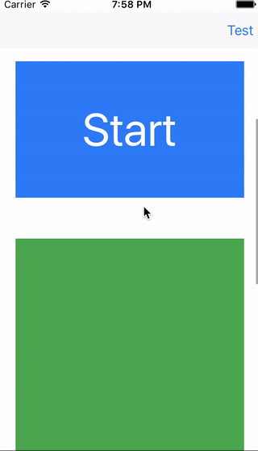

# ALSlidingNavigationBar

[](https://travis-ci.org/evilmint/ALSlidingNavigationBar)
[](http://cocoapods.org/pods/ALSlidingNavigationBar)
[](http://cocoapods.org/pods/ALSlidingNavigationBar)
[](http://cocoapods.org/pods/ALSlidingNavigationBar)
[](http://cocoapods.org/pods/ALSlidingNavigationBar)



## Example

To run the example project, clone the repo, and run `pod install` from the Example directory first.

## Requirements
* Swift >= 3.0

## Installation

ALSlidingNavigationBar is available through [CocoaPods](http://cocoapods.org). To install
it, simply add the following line to your Podfile:

```ruby
pod "ALSlidingNavigationBar"
```

## Usage

```swift
import ALSlidingNavigationBar
```

### Create ALSlidingNavigationBar
Create an object of type `ALSlidingNavigationBar` using the default constructor and passing references of your navigation bar, navigation item and the view you would like to slide.

```swift
self.slidingNavigationBar = ALSlidingNavigationBar(
    navigationBar: self.navigationController!.navigationBar,
    navigationItem: self.navigationItem,
    navigationBarView: self.navigationBarView
)
```

*Important*

The rect of the passed _navigationBarView_ must have its origin at zero and its dimensions must be the same as navigationBar's frame's.

```swift
CGRect(
    x: 0,
    y: 0,
    width: self.navigationController!.navigationBar.frame.width,
    height: self.navigationController!.navigationBar.frame.height
)
```

### Choose an anchor

There are two anchor types to choose from - view or offset.

#### View

```swift
self.slidingNavigationBar.setAnchor(view: self.anchorView)
```

#### Offset

```swift
self.slidingNavigationBar.setAnchor(offsetY: 150)
```

### Call the `didScroll` method

Call the `didScroll` method on every scroll update, (e.g. `didScroll` method from `UIScrollViewDelegate`)

```swift
self.slidingNavigationBar.didScroll(offset: self.scrollView.contentOffset.y, convertView: self.view) {
```

## Author

Aleksander Lorenc, thaxsillion@gmail.com

## License

ALSlidingNavigationBar is available under the MIT license. See the LICENSE file for more info.
